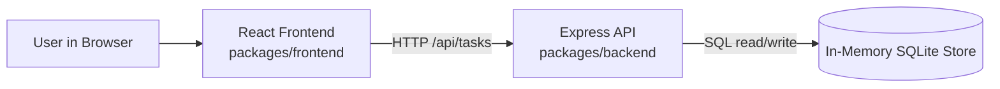
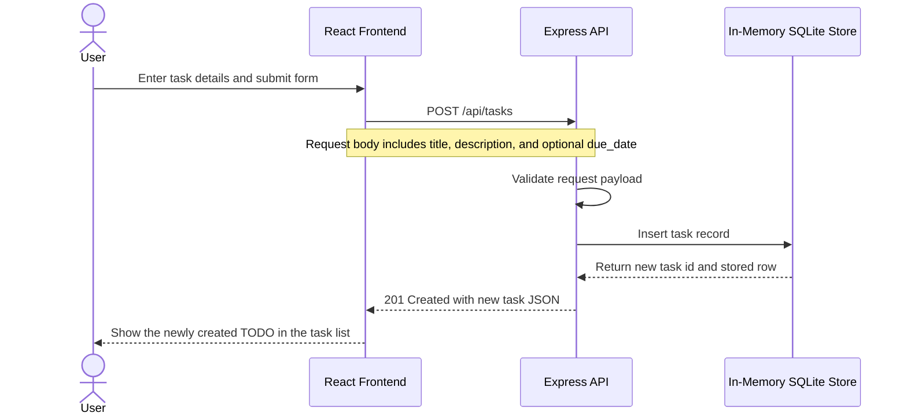

# Cloud Architecture Overview

This monorepo currently runs as a simple three-part system:

- A React frontend in `packages/frontend`
- An Express API in `packages/backend`
- An in-memory SQLite store managed inside the backend process

The frontend sends task requests to the Express API, and the API reads from and writes to the in-memory data store. Because the database is in memory, data is reset whenever the backend process restarts.

## System Context

## Create TODO Sequence

